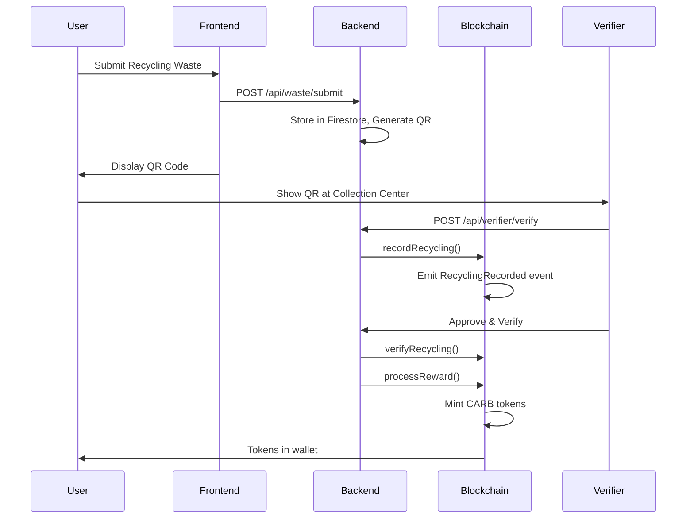

# 🌱 Green Karma - Blockchain Recycling Rewards Platform


**Green Karma** is a **fully blockchain-based** recycling rewards platform that incentivizes sustainable waste management through **Carbon Token (CARB)** rewards. Every recycling action is permanently recorded on-chain, verified by government officials, and rewarded with ERC-20 tokens.

## 🔗 Blockchain Architecture

The platform is powered by **5 interconnected smart contracts** deployed on Ethereum:

```
┌─────────────────────────────────────────────────────────────────┐
│                    GREEN KARMA SMART CONTRACTS                   │
├─────────────────────────────────────────────────────────────────┤
│                                                                  │
│   ┌──────────────────┐         ┌──────────────────┐            │
│   │  IdentityContract │◄───────►│ RecycleRecordContract│        │
│   │    (Users &       │         │   (Recycling Events)  │        │
│   │    Verifiers)     │         └──────────────────┘            │
│   └──────────────────┘                   │                       │
│                                          │                       │
│                                          ▼                       │
│   ┌──────────────────┐         ┌──────────────────┐            │
│   │    CarbonToken   │◄────────│    RewardEngine  │            │
│   │    (ERC-20 CARB) │         │  (Reward Calculator)│          │
│   └──────────────────┘         └──────────────────┘            │
│                                          │                       │
│                                          ▼                       │
│                          ┌──────────────────┐                   │
│                          │  GreenCertificate │                   │
│                          │    (ERC-721 NFT)  │                   │
│                          └──────────────────┘                   │
│                                                                  │
└─────────────────────────────────────────────────────────────────┘
```

### Smart Contract Details

| Contract | Purpose | Key Features |
|----------|---------|--------------|
| **IdentityContract** | User & Verifier Management | Role-based access control, identity hash storage, on-chain registration |
| **RecycleRecordContract** | Recycling Event Recording | IPFS integration, verification workflow, category-based records |
| **CarbonToken** | ERC-20 Reward Token | Mintable by RewardEngine, burnable for redemptions, transferable |
| **RewardEngine** | Reward Distribution | Category-based rates, automatic minting, total rewards tracking |
| **GreenCertificate** | NFT Certificates | ERC-721 NFTs for large donors (≥40kg), Bronze/Silver/Gold/Platinum tiers |

## 💰 Token Economics

**Carbon Token (CARB)** is minted as rewards based on waste category and weight:

| Waste Category | Reward Rate | Example |
|---------------|-------------|---------|
| 🖥️ E-Waste | 12 CARB/kg | 5kg laptop = 60 CARB |
| 🥤 Plastic | 5 CARB/kg | 10kg bottles = 50 CARB |
| 🔩 Metal | 4 CARB/kg | 3kg cans = 12 CARB |
| 📄 Paper | 3 CARB/kg | 7kg cardboard = 21 CARB |
| 🥬 Organic | 1 CARB/kg | 20kg compost = 20 CARB |

## 🏆 NFT Certificates for Large Donors

Large donors (≥40kg per donation) automatically receive **tamperproof blockchain certificates** stored as ERC-721 NFTs:

| Tier | Weight Threshold | Benefits |
|------|-----------------|----------|
| 🥉 **Bronze** | 40+ kg | Certificate NFT, Notification |
| 🥈 **Silver** | 100+ kg | Certificate NFT + Premium Badge |
| 🥇 **Gold** | 500+ kg | Certificate NFT + Featured Status |
| 💎 **Platinum** | 1,000+ kg | Certificate NFT + Ambassador Status |

Certificates are:
- ✅ **Immutable** - Stored permanently on blockchain
- ✅ **Verifiable** - Anyone can verify authenticity
- ✅ **Transferable** - Can be showcased in wallets
- ✅ **Automatic** - Minted instantly upon verification

## 🚀 Quick Start

### Prerequisites

- Node.js 18+
- MetaMask or compatible Web3 wallet
- Git

### 1. Clone & Install

```bash
git clone https://github.com/your-username/green-karma.git
cd green-karma

# Install all dependencies
cd blockchain && npm install
cd ../backend && npm install
cd ../frontend && npm install
```

### 2. Start Local Blockchain

```bash
cd blockchain

# Start Hardhat node
npx hardhat node

# In new terminal - Deploy contracts
npm run deploy:local
```

### 3. Start Backend

```bash
cd backend

# Configure environment
cp .env.example .env
# Edit .env with your Firebase credentials

# Start server
npm run dev
```

### 4. Start Frontend

```bash
cd frontend
npm run dev
```

### 5. Connect Wallet

1. Open http://localhost:3000
2. Add Hardhat network to MetaMask:
   - Network Name: Hardhat
   - RPC URL: http://localhost:8545
   - Chain ID: 1337
   - Symbol: ETH
3. Import a test account from Hardhat node output

## 📁 Project Structure

```
green-karma/
├── blockchain/              # Smart Contracts
│   ├── contracts/
│   │   ├── IdentityContract.sol
│   │   ├── RecycleRecordContract.sol
│   │   ├── CarbonToken.sol
│   │   └── RewardEngine.sol
│   ├── scripts/
│   │   └── deploy.js
│   └── hardhat.config.js
│
├── backend/                 # Node.js + Express API
│   ├── routes/
│   │   ├── auth.js         # Registration & Login
│   │   ├── waste.js        # Submission handling
│   │   ├── verifier.js     # Verification endpoints
│   │   └── user.js         # User dashboard data
│   ├── utils/
│   │   └── blockchain.js   # Smart contract interactions
│   └── config/
│       └── firebase.js     # Firebase Admin SDK
│
└── frontend/                # Next.js 14 + React
    ├── pages/
    │   ├── index.js        # Landing page with live stats
    │   ├── dashboard.js    # User dashboard
    │   ├── verifier.js     # Verifier portal
    │   ├── register.js     # Registration with wallet
    │   └── redeem.js       # Token redemption
    ├── providers/
    │   ├── Web3Provider.js
    │   └── BlockchainProvider.js
    ├── lib/
    │   ├── blockchain.js   # ethers.js service
    │   └── contracts.js    # ABIs & addresses
    └── components/
        └── BlockchainComponents.js
```

## 🔧 Technical Stack

### Blockchain Layer
- **Solidity** ^0.8.20 - Smart contract language
- **OpenZeppelin** - Secure contract standards (ERC-20, AccessControl)
- **Hardhat** - Development framework & local node
- **ethers.js** v6 - Contract interaction library

### Backend
- **Node.js** + Express - API server
- **Firebase Admin SDK** - User authentication & Firestore
- **ethers.js** - Blockchain integration

### Frontend
- **Next.js 14** - React framework
- **RainbowKit** + **wagmi** - Wallet connection
- **ethers.js** - Direct contract calls
- **TailwindCSS** - Styling
- **Framer Motion** - Animations

## 🔐 Security Features

1. **Role-Based Access Control** - Only registered verifiers can verify submissions
2. **Identity Hashing** - User identities are hashed before on-chain storage
3. **Firebase Authentication** - Secure user authentication
4. **On-Chain Verification** - All rewards require verifier approval
5. **Immutable Records** - Recycling history cannot be altered

## 📊 On-Chain Data Flow



## 🎯 Key Features

### For Users
- ✅ Connect wallet (MetaMask, Rainbow, etc.)
- ✅ Submit recycling with photo evidence
- ✅ Receive QR code for verification
- ✅ Earn CARB tokens on verification
- ✅ Track on-chain recycling history
- ✅ View real token balance from blockchain
- ✅ Redeem tokens for rewards

### For Verifiers
- ✅ Government official registration
- ✅ Scan QR codes to find submissions
- ✅ Approve/reject with weight adjustment
- ✅ View verification history with txHash

### Blockchain Features
- ✅ Live on-chain statistics on homepage
- ✅ Real-time token balance display
- ✅ Network status indicator
- ✅ Transaction hash tracking
- ✅ Event listening for updates

## 🧪 Testing

```bash
cd blockchain
npm run test
```

## 🚀 Deployment

### Smart Contracts

```bash
# Deploy to Polygon Mumbai testnet
cd blockchain
npm run deploy:mumbai

# Deploy to Polygon mainnet
npm run deploy:polygon
```

### Backend
- Deploy to Railway, Render, or Heroku
- Set environment variables for Firebase and contract addresses

### Frontend
- Deploy to Vercel or Netlify
- Update `NEXT_PUBLIC_*` environment variables

## 🏆 Hackathon Highlights

This project demonstrates:

1. **Full Blockchain Integration** - Not just a token, but a complete on-chain system
2. **Real Smart Contracts** - 4 interconnected Solidity contracts
3. **ERC-20 Token Implementation** - Standard-compliant reward token
4. **Role-Based Access Control** - Secure verifier system
5. **Frontend Direct Calls** - Users interact with blockchain directly
6. **Live On-Chain Data** - Real-time stats from deployed contracts

## 📜 License

MIT License - See [LICENSE](LICENSE) for details.

---

**Built with 💚 for a sustainable future** | Blockchain Domain Hackathon Submission
